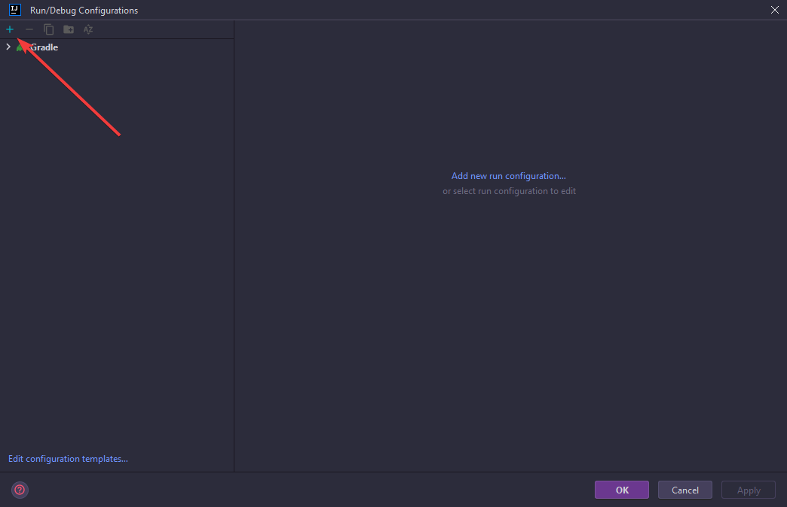

# Debugging

This demo will show how to setup Debugging inside of IntelliJ IDEA (Community and Ultimate). Debugging can be used on most if not all Java projects but for this we will be using spigot

## Setup

### Step 1 - Run Configuration Creation

Open the run configuration screen. This can be found in the top right of your project screen, it may have a current run configuration open that you use for your project or just say Edit Configurations.

Images

##### Images

### Step 2 - Run Configuration Modification

Create a new debug run configuration and modify any info. Inside the popup window "Run/Debug Configurations" press the plus icon near the top left and find "Remove JVM Debug", click on that then you have your run configuration. You can now modify the name or port, for this example we will use "Server Debug" and keep the port as the default 5005. \
For Step 3 you should keep this screen open.

Images

##### Images

### Step 3 - Server Modification

Now we need to tell our server how to connect to this Debug Configuration. Inside of the run configuration window for your Debug Configuration you should have a box called "Command line argument for remote JVM", copy everything inside this box and now apply and close the window. Once thats completed we need to now give the argument to our server. This will change depending on how you start your server, we will be using a shell script inside this example. Stop your server and open the startup script, now locate the line that starts your server. It might look something like this `java -jar spigot-1.20.4.jar`. Before the jar name paste that argument you got from IntelliJ and save the file, the line should now look like `java -agentlib:jdwp=transport=dt_socket,server=y,suspend=n,address=*:5005 -jar spigot-1.20.4.jar`.

Images

##### Images

### Step 4 - Creating Breakpoints

Start your server, the server now knows how to connect to intellij and start tracking your code. Now run the debug task by selecting the run configuration in the top right and press the red Bug icon, and now its running. To debug something you will need to add breakpoints into your code. This is done by clicking in the gutter of a line of code and a red dot should appear and the line turns red, now trigger the code from your server, for example running a command or triggering an event. Once the code runs intellij will pause the server and give you a view of what is currently happening, this includes values and method calls. Now you can inspect whats happening, once you are happy with what you see press the play button in the debug panel at the bottom, near the left side of it and that will continue the server or run untill your next break point triggers.

Images

##### Images

### Step 5 - Stopping the debugger

That is all you need to do to debug your server, to stop it just stop the run configuration in by pressing the red stop icon in the top right if you still have the run configuration selected, if not press the red stop icon in the debug panel.

Images

##### Images

